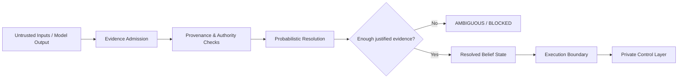

# Brain AI — Public Engineering Showcase

> **Public disclosure edition.** This repository intentionally contains architecture-level documentation and selected validation evidence only. The trusted-core implementation, research generators, internal thresholds, security-sensitive control logic, and unreleased research remain private.

## What is Brain AI?

Brain AI is an experimental **epistemic-control architecture for AI agents**.

The project explores a practical question:

> How can an AI system reason over uncertain or conflicting evidence without automatically treating model output as truth or action authority?

The architecture is designed so that a model may propose, infer, or recommend, while a separate control layer decides what evidence is admissible, how much confidence it deserves, whether ambiguity remains, and whether any downstream action is authorized.

This repository is a **portfolio and research showcase**, not the full implementation.

## Engineering themes demonstrated

- Structured hypothesis representation
- Probabilistic evidence resolution
- Sequential Bayesian updating
- Evidence provenance and source identity
- Reliability and authorization controls
- Active investigation under bounded budgets
- Explicit ambiguity / refusal states
- Separation of epistemic resolution from executable authority
- Fail-closed behavior for malformed or unjustified states
- Frozen trusted-core evaluation
- Isolated-worker / process-boundary testing
- Reproducible adversarial stress testing
- Evidence sealing and hash-based verification

## Selected validation milestone

The strongest sealed public milestone currently disclosed is the **R-013 / v4.3 million-world simulation**:

| Metric | Result |
|---|---:|
| Simulated worlds | 1,000,000 |
| Worlds resolved | 444,727 |
| Correct resolutions | 437,087 |
| Incorrect resolutions | 7,640 |
| Accuracy among resolved worlds | 98.282092% |
| False-resolution rate across all worlds | 0.764% |
| Structural checks | 100% |

These results apply to the tested simulator and candidate. They are **not** a claim of formal correctness, AGI, or universal real-world performance.

## Architecture — public view



The implementation behind the final execution boundary is intentionally not disclosed here.

## What is deliberately withheld

This public repository does **not** include:

- Trusted-core resolver source
- Exact authorization schedules or thresholds
- Internal provenance / identity-binding implementation
- Research world generators and hidden evaluation corpora
- Replay/state-origin hardening details
- Concurrency-sensitive security mechanisms
- Capability-broker or single-use authority mechanisms
- Action Qualification / Authority Proof implementation
- R-014 / R-015 unreleased designs
- Production secrets, credentials, infrastructure configuration, or private datasets

## Why publish a partial repository?

The objective is to demonstrate:

1. **0-to-1 system design**
2. **Evaluation discipline**
3. **Adversarial engineering**
4. **Security-aware AI architecture**
5. **Clear separation between what has been built, tested, proposed, and not yet proven**

without publishing the parts of the architecture that are security-sensitive or potentially proprietary.

## Current status

Brain AI should be treated as an **experimental AI control architecture**.

It has substantial mechanism-level and simulation validation, but the public evidence does not establish:

- artificial general intelligence,
- formal mathematical correctness,
- superiority over simpler agent architectures on real-world tasks,
- immunity to prompt injection or host compromise,
- production-scale distributed maturity.

See [`docs/LIMITATIONS.md`](docs/LIMITATIONS.md) for the disclosure boundary.

## Repository structure

```text
.
├── .gitignore
├── MANIFEST.sha256.json
├── README.md
├── NOTICE.md
├── docs/
│   ├── ARCHITECTURE.md
│   ├── SECURITY_MODEL.md
│   ├── VALIDATION.md
│   └── LIMITATIONS.md
└── evidence/
    └── public-r013-summary.json
```

## Author

**Glenn Murray**  
AI Systems / Forward Deployed Engineering

---

**Public showcase only — core implementation retained privately.**

---

## Verify the public research bundle

The public evidence and SHA-256 manifest can be checked locally:

```bash
python scripts/verify_public_evidence.py
```

This checks the published R-013 result arithmetic and the hashes of tracked disclosure files.

It does **not** rerun the private research simulation or establish production correctness.

See [Project Relationships](docs/PROJECT_RELATIONSHIPS.md) for how Brain AI differs from AAK and Agent Security Lab.
